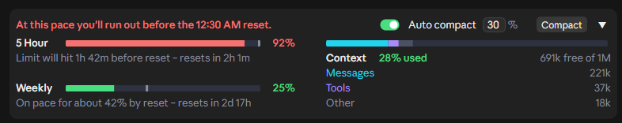
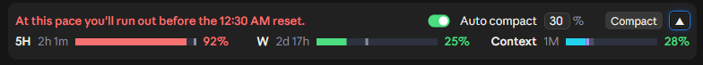
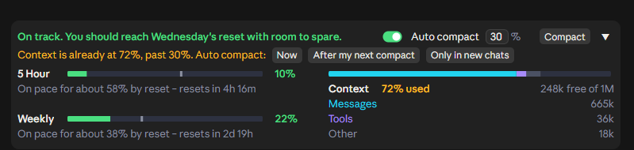
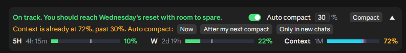
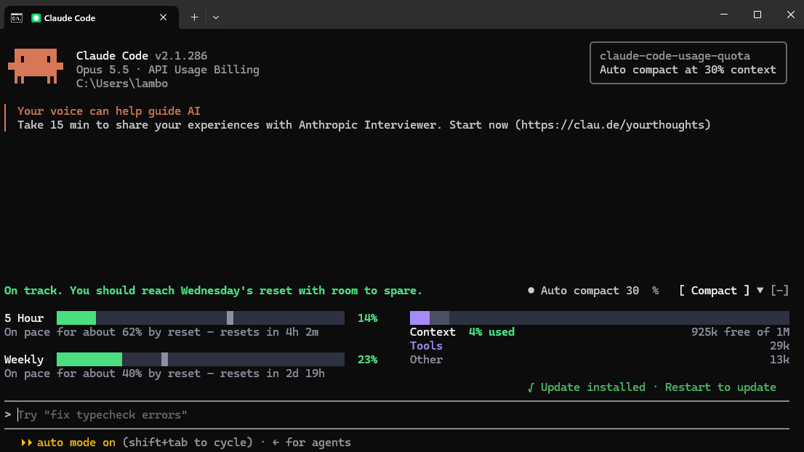
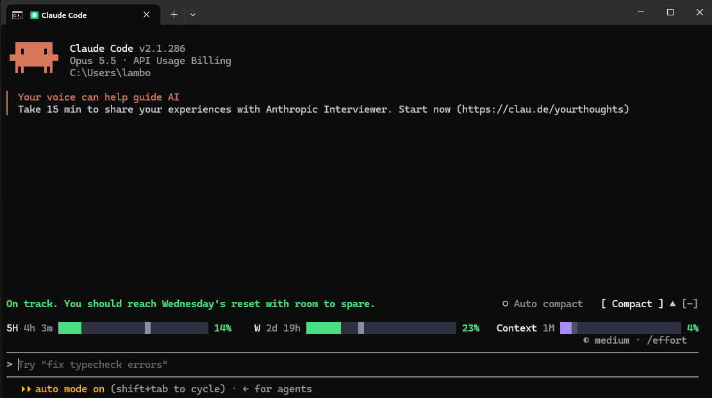

# Claude Code Usage Quota Mod with Auto Compact

     

**Know your Claude limits before they hit you.** A live band above the Claude Code prompt that shows your plan limits, forecasts whether you'll run out before they reset, and shows how full your context window is. **Compact in one click, or let it compact automatically.**

The 5 Hour and Weekly limits are **your whole Claude account's**, not just Claude Code's: they include what you use in Claude chat and Cowork too. For now, the band shows in Claude Code, in the desktop app and the terminal.

Type **`/quota`** to turn the band off and on.

## Expanded


## Collapsed

Collapse it to a single row that still shows the time left until each limit resets:


> [!TIP]
> **Never hit a full context again: Auto compact, on by one click.**
> Turn on **Auto compact** and the band compacts your chat for you once the context reaches **30%** (the default; set anything from 15 to 99). A long context costs more on every reply, so compacting early keeps each reply cheaper and your limits lasting longer. It waits for a reply to finish, never interrupts one, and is set separately for each chat.
>
> Want it now? The **Compact** button runs `/compact` in one click.

## What it shows

**Plan usage limits** (5 Hour and Weekly)
- The % used, matching the app's own *Plan usage limits* panel.
- A forecast of where you'll be at reset, as a grey tick on the bar and a note: *On pace for about 87% by reset – resets in 23m*.
- A headline that tells you at a glance: *On track. You should reach Wednesday's reset with room to spare.* or *At this pace you'll run out before the 8:40 PM reset.*
- The forecast starts from your usual pace, which it learns from your last few windows, and shifts to your actual pace as the window goes on. A burst of use early in a window doesn't turn it red. It also leaves out the one-off jump when a long chat is reopened and re-read.

- Colours: a bar and its % turn amber at 75% used and red at 90%, or sooner if the forecast says you'll run out.

When you're on course to run out, the headline, the bar and its % turn red, and the note says how early you'd hit the limit:





**Context window**
- The % used and the space free, as `/context` counts it, split into Messages, Tools and Other.
- The % turns amber at 50% and red at 80%. A long context costs more on every reply, so that's the point to compact.

**Compacting**
- **Compact** runs `/compact` in one click.
- **Auto compact** compacts on its own once the context reaches the % you set. It's 30% by default when you turn it on, and you can type anything from 15 to 99. It never runs in the middle of a reply, and it's set separately for each chat.

If you turn it on, or set a %, when the chat is already past that point, it asks before doing anything:





- **Now** compacts this chat straight away.
- **After my next compact** waits. Once this chat is compacted some other way (the Compact button, `/compact`, or Claude Code's own auto compact), it takes over from there and compacts at your % again.
- **Only in new chats** leaves this chat alone for now. The setting stays on, and applies again the next time the chat is opened.

**Fits everywhere**
- The collapsed or expanded choice is shared across all your chats.
- Works in light and dark themes, at every chat width down to the narrowest.

| Light theme | Narrowest chat |
| --- | --- |
|  |  |
|  |  |

## Where it works

Mods are a Claude Code feature, so the band shows wherever Claude Code draws mods:

- **Claude desktop app, Code tab** (not in WSL sessions)
- **Claude Code in a terminal**, including an editor's built-in terminal and JetBrains

It doesn't appear in the VS Code extension's chat panel, in Claude chat or Cowork, or in cloud sessions. The limits it shows are your whole account's, though, so they include what you use in chat and Cowork too.

> [!NOTE]
> In the desktop app, the band shows once a chat has started. On a brand-new chat screen (the *Welcome back* page with an empty prompt box) there's no Claude Code session yet, so no mod can draw there. Send your first message, or open an existing chat, and the band appears straight away.

In the terminal, expanded and collapsed:





In the terminal, the ▲/▼ arrow expands and collapses the band. The `[-]` after it is Claude Code's own control and hides the band entirely; ctrl+x then ctrl+a brings it back.

## Install

You need a recent Claude Code (with mods, also called function hooks), signed in with a Claude plan (Pro or Max) for the plan limits. With an API key, the context part still works.

### In the Claude desktop app

1. Open the **Code** tab and start a session (any folder works).
2. Paste this as your message and send it:

   ```text
   Install the claude-code-usage-quota plugin from the GitHub marketplace anantraghunath/claude-code-usage-quota-mod
   ```

3. Claude runs the install for you. If it asks to run a `claude plugin` command, allow it.
4. Quit the Claude app fully and open it again. The band appears above the prompt in the Code tab.

### In a terminal

1. Start Claude Code with `claude`.
2. Type this one command:

   ```text
   /plugin install claude-code-usage-quota --marketplace anantraghunath/claude-code-usage-quota-mod
   ```

3. You'll see *Installed claude-code-usage-quota. Plugin is now active.* and the band appears above the prompt.

Installing either way installs it for both: the desktop app and the terminal share the same plugins.

### Updating

Ask Claude, in either place:

```text
Update the claude-code-usage-quota plugin from its marketplace
```

Then restart the app, or the terminal session.

### Uninstalling

**In the desktop app**, ask Claude in the Code tab:

```text
Remove the claude-code-usage-quota-mod plugin marketplace
```

Then quit the Claude app fully and open it again.

**In a terminal**, inside Claude Code type:

```text
/plugin marketplace remove claude-code-usage-quota-mod
```

Removing the marketplace uninstalls the mod with it.

Then restart the terminal session. Either way removes it from both the desktop app and the terminal. (Just want it out of sight for a while? `/quota` hides the band without uninstalling.)

<details>
<summary>From your own shell instead</summary>

```bash
claude plugin marketplace add anantraghunath/claude-code-usage-quota-mod; claude plugin install claude-code-usage-quota@claude-code-usage-quota-mod
```

To update:

```bash
claude plugin marketplace update claude-code-usage-quota-mod; claude plugin update claude-code-usage-quota@claude-code-usage-quota-mod
```

To uninstall:

```bash
claude plugin marketplace remove claude-code-usage-quota-mod
```

</details>

## Privacy

Everything runs on your machine. The mod reads what Claude Code already has (your context window and the limits each reply carries). About every 2 minutes it also asks Anthropic's own usage service for your limits, through your existing Claude login, the same request the app's usage panel makes. The mod never sees your credentials, and nothing is sent anywhere else. In the desktop app it reads the app's theme setting so it can match light or dark.

## Feedback and contributing

This is a first release, and I'd love to hear how it works for you. [Open an issue](https://github.com/anantraghunath/claude-code-usage-quota-mod/issues) for bugs, ideas, or a screenshot of something that looks off. Pull requests are welcome.

To work on it, clone the repo and load it straight from the folder:

```bash
claude --plugin-dir ./claude-code-usage-quota-mod
```

```bash
claude plugin test ./claude-code-usage-quota-mod
```

If you find it useful, a ⭐ helps other people find it.

## License

[MIT](LICENSE) © 2026 Anant Raghunath
