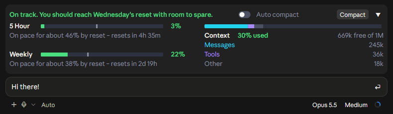
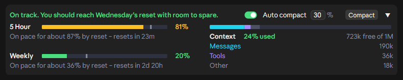
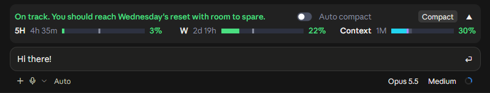
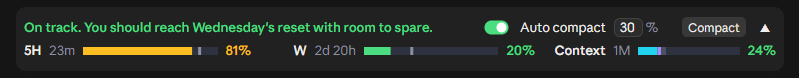
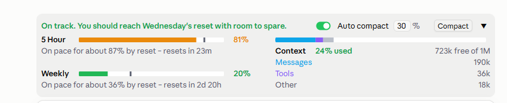
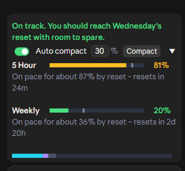
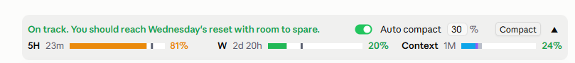
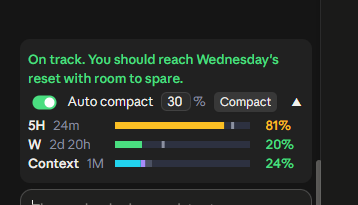

# Claude Usage Quota Mod

**Know your Claude limits before they hit you.** A live band above the Claude Code prompt that shows your plan limits, forecasts whether you'll run out before they reset, and shows how full your context window is. Compact in one click, or let it compact automatically.





Collapse it to a single row that still shows the time left until each limit resets:





## What it shows

**Plan usage limits** (5 Hour and Weekly)
- The % used, matching the app's own *Plan usage limits* panel.
- A forecast of where you'll be at reset, as a grey tick on the bar and a note: *On pace for about 87% by reset – resets in 23m*.
- A headline that tells you at a glance: *On track. You should reach Wednesday's reset with room to spare.* or *At this pace you'll run out before the 8:40 PM reset.*
- The forecast starts from your usual pace, which it learns from your last few windows, and shifts to your actual pace as the window goes on. A burst of use early in a window doesn't turn it red. It also leaves out the one-off jump when a long chat is reopened and re-read.
- Colours: a bar and its % turn amber at 75% used and red at 90%, or sooner if the forecast says you'll run out.

**Context window**
- The % used and the space free, as `/context` counts it, split into Messages, Tools and Other.
- The % turns amber at 50% and red at 80%. A long context costs more on every reply, so that's the point to compact.

**Compacting**
- **Compact** runs `/compact` in one click.
- **Auto compact** compacts on its own once the context reaches the % you set (default 30%, range 15–99). It never runs in the middle of a reply. It's set separately for each chat. If you set a % the chat is already past, it asks whether to compact now, after your next compact, or only in new chats.

**Fits everywhere**
- The collapsed or expanded choice is shared across all your chats.
- Works in light and dark themes, at every chat width down to the narrowest, in the Claude desktop app's Code tab and in the terminal.
- `/quota` turns the band off and on.

| Light theme | Narrowest chat |
| --- | --- |
|  |  |
|  |  |

## Install

You need a recent Claude Code (with mods, also called function hooks), signed in with a Claude plan (Pro or Max) for the plan limits. With an API key, the context part still works.

```bash
claude plugin marketplace add anantraghunath/claude-usage-quota-mod
```

```bash
claude plugin install claude-usage-quota@claude-usage-quota-mod
```

Then open a new chat, or restart the Claude app. The band appears above the prompt.

To update:

```bash
claude plugin marketplace update claude-usage-quota-mod
```

```bash
claude plugin update claude-usage-quota@claude-usage-quota-mod
```

## Privacy

Everything runs on your machine. The mod reads what Claude Code already has (your context window and the limits each reply carries). About every 2 minutes it also asks Anthropic's own usage service for your limits, through your existing Claude login, the same request the app's usage panel makes. The mod never sees your credentials, and nothing is sent anywhere else. In the desktop app it reads the app's theme setting so it can match light or dark.

## Feedback and contributing

This is a first release, and I'd love to hear how it works for you. [Open an issue](https://github.com/anantraghunath/claude-usage-quota-mod/issues) for bugs, ideas, or a screenshot of something that looks off. Pull requests are welcome.

To work on it, clone the repo and load it straight from the folder:

```bash
claude --plugin-dir ./claude-usage-quota-mod
```

```bash
claude plugin test ./claude-usage-quota-mod
```

If you find it useful, a ⭐ helps other people find it.

## License

[MIT](LICENSE) © 2026 Anant Raghunath
